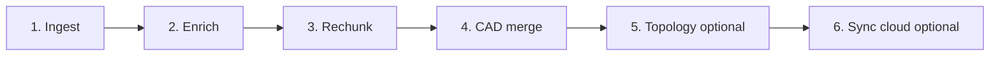

# Librarian PDF Processing Pipeline

End-to-end workflow for ingesting structural plan PDFs, building searchable layers, and applying drawing-region chunking **without cross-chunk contamination**.

The **Librarian Agent** (search UI / `api.py`) only queries an existing index. PDF processing runs through **`main.py`** commands below.

---

## Pipeline stages (order matters)



| Stage | Command / code | Output | API cost |
|-------|----------------|--------|----------|
| **Ingest** | `build` / `update` / pipeline `ingest` | Page-level chunks in Chroma, `metadata_db.json` | Vision on sparse pages |
| **Enrich** | `enrich` / pipeline `enrich` | `data/enriched_*.json` (title blocks, sheet types) | GPT on plan pages |
| **Auto-train + rechunk** | `auto-train-rechunk` or pipeline default | Vision train on 6 examples → rechunk → inspect training pages → retry | GPT-4o vision per sheet |
| **Rechunk** | `apply-drawing-chunks` (manual) | One chunk per drawing region; vision cache in `data/drawing_chunks/` | GPT-4o vision per sheet |
| **CAD** | `merge-cad-knowledge` | Per-chunk view labels + cross-refs in vector text | Embeddings only |
| **Topology** | `topology_analyzer.py` then `merge-deep-vision` | `data/enhanced_topology_*.json` merged into **page-level** chunks only | Heavy (vision + GPT) |
| **Profiles** | `build-project-profiles` | `data/project_profiles/` + overview chunks | GPT-4o |
| **Sync** | `sync-cloud` | GCS backup of `vector_db/`, metadata, PDFs | None |

**Recommended one-shot command** (per PDF, saves after each project):

```bash
# Auto-trains vision, rechunks, validates training pages, saves report
python main.py process-pipeline --file Edwards --sync-cloud

# Rechunk only (no ingest/enrich)
python main.py auto-train-rechunk --file Goldenwest --rechunk-retries 1 --sync-cloud
```

Validation report: `data/training/rechunk_validation_report.json`

**All active PDFs:**

```bash
python main.py process-pipeline --sync-cloud
```

**Re-chunk only** (index already ingested + enriched):

```bash
python main.py process-pipeline --no-ingest --no-enrich --file Goldenwest
```

**Include deep-vision topology** (only if `enhanced_topology_*.json` exists):

```bash
python main.py process-pipeline --topology --file Westminster
```

### Flags

| Flag | Effect |
|------|--------|
| `--file <name>` | One PDF (partial name OK) |
| `--no-ingest` | Skip PDF extract + page-level index |
| `--no-enrich` | Skip title-block classification |
| `--no-rechunk` | Skip drawing-region chunking |
| `--no-auto-train` | Skip vision training at pipeline start (use saved model) |
| `--no-validate-rechunk` | Skip post-rechunk inspect on training pages |
| `--rechunk-retries N` | Re-apply with fresh vision if validation fails (default 1) |
| `--no-cad` | Skip CAD knowledge merge |
| `--topology` | Merge deep-vision topology (page-level chunks only) |
| `--sync-cloud` | Push vector DB to GCS after each project |
| `--force-refresh` | Ignore vision region cache during rechunk |

---

## Layer dependencies

| Layer | Reads from | Writes to | Safe to re-run? |
|-------|------------|-----------|-----------------|
| Ingest | PDF files | Chroma + metadata | **Destructive** — replaces all chunks for that PDF with page-level |
| Enrich | PDF + vision | `data/enriched_*.json` | Yes (JSON only; does not touch Chroma until merge) |
| Rechunk | Enriched JSON + vision cache + indexed page text | Chroma (replaces PDF chunks) | Yes per PDF |
| CAD merge | Chunk text + enriched JSON | Chroma updates | Yes per PDF |
| Deep topology | PDF vision | `data/enhanced_topology_*.json` | Skips completed `deep_vision` files |
| Topology merge | Topology JSON | Chroma (page-level chunks only) | Yes |
| Project profiles | GP sheets + topology | `data/project_profiles/` + Chroma | Yes |

**Do not run `build` or pipeline ingest on a PDF that already has drawing-region chunks** unless you intend to reset to page-level and re-run the full pipeline.

---

## Contamination risks and mitigations

### 1. Page-level text bleed into region chunks (HIGH — addressed)

**Risk:** Whole-page OCR or `[ENRICHED METADATA]` appended to every drawing chunk → MIXED chunks (DETAIL 1 + ELEVATION in one hit).

**Mitigations:**
- Rechunk uses spatial OCR + bounded text between neighbor labels (`drawing_region_chunker.py`).
- `vector_store.add_documents` skips `[ENRICHED METADATA]` for `[DRAWING REGION CHUNK]` chunks.
- `enrich-kb` merge skips region chunks.
- Validate with `inspect-chunks` after rechunk.

### 2. Page-wide cross-refs on every region chunk (MEDIUM — addressed)

**Risk:** Sheet-level section/detail lists attached to each region chunk.

**Mitigation:** `cad_drawing_knowledge.build_chunk_fields` drops page-level `cad_section_cuts`, `cad_detail_callouts`, etc. for region chunks; uses chunk-local cross-refs only.

### 3. Deep-vision topology duplicated on every region (MEDIUM — addressed)

**Risk:** `merge-deep-vision` appends the same page topology block to all region chunks on that page.

**Mitigation:** `vector_store.merge_deep_vision_topology` **skips** `[DRAWING REGION CHUNK]` chunks. Topology remains a page-level layer; region chunks rely on isolated OCR + CAD metadata.

### 4. Sheet category / general notes on region chunks (MEDIUM — addressed)

**Risk:** `merge-sheet-categories` adds `[SHEET CATEGORY]` to every chunk on a page.

**Mitigation:** Sheet category merge skips drawing-region chunks.

### 5. CAD merge across unrelated PDFs (LOW — addressed)

**Risk:** `apply-drawing-chunks` used to run CAD merge on **all** projects after rechunking one file.

**Mitigation:** CAD merge now runs only on PDFs processed in that apply/pipeline run.

### 6. Stale vision cache (MEDIUM)

**Risk:** Wrong region boundaries from an old `data/drawing_chunks/{stem}.json`.

**Mitigation:** `--force-refresh` on apply or pipeline; re-train when sheet layouts change.

### 7. Partial Chroma write / index corruption (HIGH — operational)

**Risk:** Delete + re-embed interrupted mid-file (seen on Edwards) → corrupted SQLite.

**Mitigation:** Pipeline saves per project; use `--sync-cloud` for backup; restore from GCS before re-running.

### 8. Cross-project search bleed (LOW)

**Risk:** Query returns chunks from the wrong bridge project.

**Mitigation:** Not a processing contamination issue — use `project_scope` in API search or feedback. Vector metadata always includes `file_name`.

### 9. Layer order mistakes (HIGH — procedural)

| Wrong order | Consequence |
|-------------|-------------|
| Topology merge **before** rechunk | Topology on page chunks, then lost when rechunk deletes them |
| Ingest **after** rechunk | Wipes region chunks back to page-level |
| `enrich-kb` on region index without skip | Would append enriched blocks (now skipped in code) |

**Safe order:** ingest → enrich (JSON) → rechunk → cad → topology (optional, page-level only) → profiles (optional)

---

## New PDF checklist

1. Place PDF in `Public Projects/` (or configured `PROJECTS_FOLDER`).
2. Add 1–2 training pages to `drawing_chunk_examples.py` (see [DRAWING_REGION_CHUNKING.md](DRAWING_REGION_CHUNKING.md)).
3. `python main.py train-drawing-chunks`
4. `python main.py process-pipeline --file <Project> --sync-cloud`
5. `python main.py inspect-chunks --file <Project> --page <n>` on training pages → PASS
6. Optional: `topology_analyzer.py --file <Project>` then `process-pipeline --no-ingest --no-enrich --no-rechunk --topology --file <Project>`
7. Optional: `python main.py build-project-profiles`

---

## Related docs

- [DRAWING_REGION_CHUNKING.md](DRAWING_REGION_CHUNKING.md) — training, apply, inspect details
- [README.md](README.md) — install and quick start
